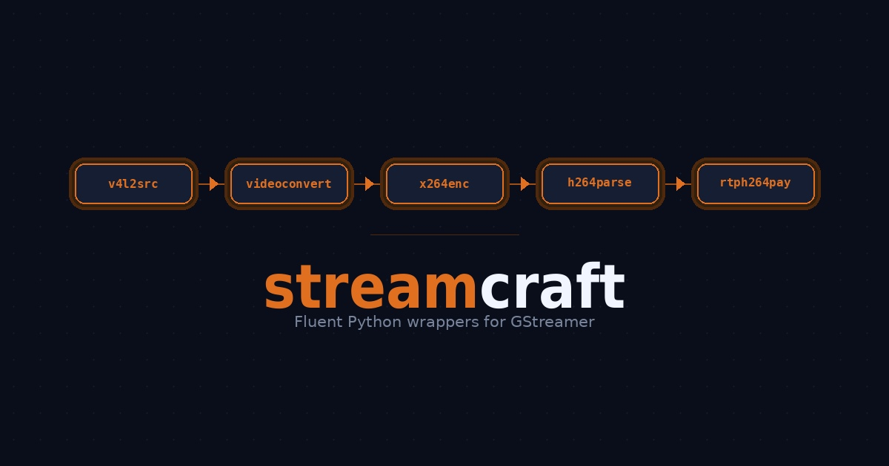

# streamcraft

Fluent Python wrappers for GStreamer — build pipelines, control cameras, and manage WebRTC sessions without the boilerplate.

[](https://github.com/ranaweerasupun/streamcraft/actions/workflows/test.yml)
[](https://www.python.org/downloads/)
[](LICENSE)
[](https://www.kernel.org/)



---

## The problem

Writing a GStreamer pipeline in Python looks like this:

```python
# 45 lines just to describe: camera → decode → encode → RTP
pipeline = Gst.Pipeline.new("video")

v4l2src = Gst.ElementFactory.make("v4l2src", "v4l2src")
v4l2src.set_property("device", "/dev/video0")
v4l2src.set_property("do-timestamp", True)
mjpeg_caps = Gst.Caps.from_string("image/jpeg,width=1280,height=720,framerate=30/1")

queue = Gst.ElementFactory.make("queue", "queue_v1")
queue.set_property("max-size-buffers", 3)
queue.set_property("max-size-time", 0)
queue.set_property("max-size-bytes", 0)
queue.set_property("leaky", 2)

jpegdec   = Gst.ElementFactory.make("jpegdec",      "jpegdec")
videoconv = Gst.ElementFactory.make("videoconvert", "videoconvert")

x264enc = Gst.ElementFactory.make("x264enc", "x264enc")
x264enc.set_property("tune",         "zerolatency")
x264enc.set_property("speed-preset", "ultrafast")
x264enc.set_property("bitrate",      2000)
x264enc.set_property("key-int-max",  30)

# ... 20 more lines of pipeline.add() and link() calls ...
```

With streamcraft the same pipeline is:

```python
from streamcraft import PipelineBuilder

pipeline, elems = (
    PipelineBuilder(name="video-pipeline")
    .element("v4l2src",    name="src",     device="/dev/video0", do_timestamp=True)
    .caps("image/jpeg,width=1280,height=720,framerate=30/1")
    .element("queue",      name="buffer",  max_size_buffers=3, leaky=2)
    .element("jpegdec")
    .element("videoconvert")
    .element("x264enc",    name="encoder", tune="zerolatency",
                                           speed_preset="ultrafast", bitrate=2000)
    .element("h264parse",                  config_interval=1)
    .caps("video/x-h264,stream-format=byte-stream,alignment=au")
    .element("rtph264pay", name="pay",     pt=96, config_interval=1, mtu=1200)
    .build()
)

# pipeline is a real Gst.Pipeline — do anything you want with it
encoder = elems["encoder"]
encoder.set_property("bitrate", 4000)
pipeline.set_state(Gst.State.PLAYING)
```

The topology is the code. Each line is one element, in the order data flows through it.

---

## What's in the library

### `PipelineBuilder`

A fluent builder for linear GStreamer pipelines. It handles the repetitive `ElementFactory.make()` → `set_property()` → `link()` / `link_filtered()` loop for you, with clear error messages when something goes wrong.

The builder only handles linear topologies by design. For elements with dynamic pads (`decodebin`, `webrtcbin`) or branching topologies (`tee`), `build()` returns a real `Gst.Pipeline` that you extend with the standard GStreamer API — the two approaches compose naturally and neither gets in the way of the other.

One detail that saves a constant small friction: GStreamer property names use hyphens (`speed-preset`, `key-int-max`, `max-size-buffers`) but Python keyword arguments must use underscores. The builder converts underscores to hyphens automatically, so you write Python-idiomatic code and the right thing happens.

```python
from streamcraft import PipelineBuilder

pipeline, elems = (
    PipelineBuilder()
    .element("audiotestsrc", num_buffers=100)
    .element("audioconvert")
    .caps("audio/x-raw,channels=1,rate=48000")
    .element("opusenc",  name="enc", bitrate=128000, complexity=5)
    .element("fakesink", sync=False)
    .build()
)

enc = elems["enc"]
print(enc.get_property("bitrate"))   # 128000
```

### `require_elements`

Checks that all the GStreamer plugins your pipeline needs are installed before you try to build anything. If something is missing, you get a clear error message with the exact `apt install` command to fix it — not a cryptic `None` return buried ten lines into your startup code.

```python
from streamcraft import require_elements

require_elements(
    "webrtcbin", "v4l2src", "jpegdec", "videoconvert",
    "x264enc", "h264parse", "rtph264pay",
    "alsasrc", "opusenc", "rtpopuspay",
)
# Raises EnvironmentError with an apt install hint if anything is missing.
# Returns None silently if everything is present.
```

### `check_v4l2_device` and `list_v4l2_devices`

Verifies that a V4L2 camera device exists, is readable, and actually opens — catching "device busy" and permission errors before you commit to building a pipeline for a real connection.

```python
from streamcraft import check_v4l2_device, list_v4l2_devices

print(list_v4l2_devices())    # ['/dev/video0', '/dev/video2']

ok, msg = check_v4l2_device("/dev/video0")
if not ok:
    raise SystemExit(f"Camera not available: {msg}")
    # e.g. "Device '/dev/video0' exists but is not readable.
    #       Try: sudo usermod -aG video $USER (then re-login)"
```

### `V4L2PTZCamera`

Controls pan, tilt, and zoom on any V4L2 camera that exposes those controls — Obsbot, Logitech PTZ Pro, and similar. It uses `v4l2-ctl` to auto-detect the camera's valid ranges at startup, so you never have to hardcode min/max values per camera model.

If no PTZ camera is connected, all operations are silent no-ops that return `False`. This means your application starts and streams video correctly even when the PTZ camera isn't plugged in.

```python
from streamcraft import V4L2PTZCamera

cam = V4L2PTZCamera("/dev/video0")

if cam.available:
    cam.set_pan(90_000)     # pan right (units are arc-seconds × 100)
    cam.set_tilt(-50_000)   # tilt down
    cam.set_zoom(200)       # zoom in (range is camera-specific)
    cam.reset()             # back to center, minimum zoom

    print(cam.status.to_dict())
    # {'available': True, 'pan': 0, 'tilt': 0, 'zoom': 100,
    #  'ranges': {'pan': {'min': -522000, 'max': 522000}, ...}}
```

### `WebRTCSession`

Manages the entire WebRTC signaling lifecycle for a GStreamer pipeline: SDP offer/answer exchange, ICE candidate buffering (including the race condition where candidates arrive before the remote description is set), GLib→asyncio thread bridging, and pipeline state transitions.

Decoupled from any web framework — `send_json` is any async callable that accepts a dict, so it works with aiohttp, FastAPI, Starlette, or raw `websockets` with no modification.

```python
from streamcraft import WebRTCSession
from aiohttp import web
import json

async def handle_ws(request):
    ws = web.WebSocketResponse()
    await ws.prepare(request)

    pipeline = build_my_pipeline()            # your PipelineBuilder call
    session  = WebRTCSession(pipeline)
    session.connect_ice_sender(ws.send_json)  # forwards local ICE candidates

    try:
        async for msg in ws:
            if msg.type == web.WSMsgType.TEXT:
                await session.handle_message(json.loads(msg.data), ws.send_json)
    finally:
        session.stop()   # releases camera, mic, and all GStreamer resources

    return ws
```

---

## Installation

streamcraft depends on GStreamer's Python bindings, which come from the system package manager and are not available on PyPI. Install the system packages first, then install streamcraft into a virtual environment.

**Step 1 — system dependencies (Debian / Ubuntu / Raspberry Pi OS):**

```bash
sudo apt update && sudo apt install -y \
    python3-gi \
    gir1.2-gstreamer-1.0 \
    gir1.2-gst-plugins-base-1.0 \
    gir1.2-gst-plugins-bad-1.0 \
    gstreamer1.0-plugins-base \
    gstreamer1.0-plugins-good \
    gstreamer1.0-plugins-bad \
    gstreamer1.0-plugins-ugly \
    gstreamer1.0-libav \
    gstreamer1.0-tools \
    gstreamer1.0-alsa \
    v4l-utils
```

**Step 2 — create a virtual environment with access to the system packages:**

The `--system-site-packages` flag is important — it gives the virtual environment visibility into the GStreamer bindings that `apt` installed in Step 1. Without it, `import gi` would fail inside the venv even though GStreamer is installed on the system.

```bash
python -m venv --system-site-packages ~/streamcraft_env
source ~/streamcraft_env/bin/activate
```

**Step 3 — install streamcraft:**

```bash
# From GitHub:
pip install git+https://github.com/ranaweerasupun/streamcraft.git

# With aiohttp for the streaming server example:
pip install "git+https://github.com/ranaweerasupun/streamcraft.git#egg=streamcraft[aiohttp]"

# Or clone and install locally:
git clone https://github.com/ranaweerasupun/streamcraft.git
cd streamcraft
pip install -e ".[aiohttp]"
```

---

## Example project — bidirectional streaming server

The `examples/` directory contains a complete bidirectional video and audio streaming server. Run it on a Raspberry Pi 5; connect from any browser on a device in the same [Tailscale](https://tailscale.com) network.

What it does: streams live H.264 video and Opus audio from the Pi's camera to the browser over WebRTC, receives the browser's camera and microphone back on the Pi, and exposes the camera's pan/tilt/zoom controls through sliders in the browser UI. No robot-specific code, no serial ports, no joysticks — just streaming, which is useful to almost anyone.

What streamcraft replaces in the example: the GStreamer pipeline that would have been ~130 lines of `ElementFactory.make()` and `link()` boilerplate is 12 readable lines. The WebRTC signaling handler that would have been ~140 lines of SDP parsing, ICE buffering, and GLib→asyncio threading code is one `WebRTCSession` call. The PTZ camera class that would have been ~190 lines is one `V4L2PTZCamera` line.

**Running the example:**

```bash
git clone https://github.com/ranaweerasupun/streamcraft.git
cd streamcraft

# Set up the environment
python -m venv --system-site-packages ~/streamcraft_env
source ~/streamcraft_env/bin/activate
pip install -e ".[aiohttp]"

# Generate a TLS certificate
# Option A — Tailscale HTTPS (requires a paid Tailscale plan):
sudo tailscale cert <your-device-fqdn>

# Option B — self-signed certificate (free, browser will show a warning once):
sudo mkdir -p /var/lib/tailscale/certs
sudo openssl req -x509 -newkey rsa:4096 -days 365 -nodes \
    -keyout /var/lib/tailscale/certs/<your-fqdn>.key \
    -out    /var/lib/tailscale/certs/<your-fqdn>.crt \
    -subj "/CN=<your-fqdn>"

# Grant your user read access to the certificate files
sudo setfacl -m u:$USER:x  /var/lib/tailscale
sudo setfacl -m u:$USER:rx /var/lib/tailscale/certs
sudo setfacl -m u:$USER:r  /var/lib/tailscale/certs/<your-fqdn>.crt
sudo setfacl -m u:$USER:r  /var/lib/tailscale/certs/<your-fqdn>.key

# Edit the four config lines at the top of the server file
nano examples/streaming_server.py

# Run from the project root
python examples/streaming_server.py
```

Then open `https://<your-device-fqdn>:8443` in a browser on another device in your Tailscale network.

---

## Design philosophy

**Sit on top, not underneath.** streamcraft reduces boilerplate without hiding GStreamer concepts. You still work with real `Gst.Pipeline`, `Gst.Element`, and `Gst.Pad` objects. When you need to do something the builder doesn't support, you use the standard GStreamer API directly on the returned objects — the library never gets in the way.

**Linear pipelines only (in the builder).** The builder handles the common case: a straight chain from source to sink. This deliberate constraint keeps the builder simple and predictable. Anything more complex uses the builder for the linear parts and the raw GStreamer API for the rest.

**Fail fast with actionable messages.** Missing plugin? You get the exact `apt install` command. Bad property name? You get the GStreamer hyphenated name next to your typo, plus the `gst-inspect-1.0` command to look it up. Failed link? You get the element names and a hint about which pad is incompatible. The error messages are part of the library's contract.

**No web framework lock-in.** `WebRTCSession` takes a callable, not a framework object. Any async function that accepts a dict and sends it as JSON is compatible — aiohttp, FastAPI, Starlette, raw `websockets`, or anything else.

---

## Running the tests

```bash
# Software-only tests — no hardware required, runs in CI
pytest

# Including hardware tests — requires a camera on /dev/video0
pytest -m hardware
```

The test suite has 93 tests. Hardware-dependent tests are marked `@pytest.mark.hardware` and skipped by default. The software-only tests use GStreamer's built-in test elements (`videotestsrc`, `audiotestsrc`, `fakesink`) and complete in under one second.

---

## Project structure

```
streamcraft/
├── streamcraft/               ← the installable Python package
│   ├── __init__.py           ← public API
│   ├── pipeline.py           ← PipelineBuilder
│   ├── devices.py            ← require_elements, V4L2PTZCamera, check_v4l2_device
│   └── webrtc.py             ← WebRTCSession
├── examples/
│   ├── streaming_server.py   ← bidirectional streaming server (Raspberry Pi)
│   └── interface.html        ← browser UI served by the example server
├── tests/
│   ├── test_pipeline.py      ← 37 tests for PipelineBuilder
│   ├── test_devices.py       ← 37 tests for devices module
│   └── test_webrtc.py        ← 19 tests for WebRTCSession
├── pyproject.toml
└── README.md
```

---

## License

MIT — see [LICENSE](LICENSE) for details.